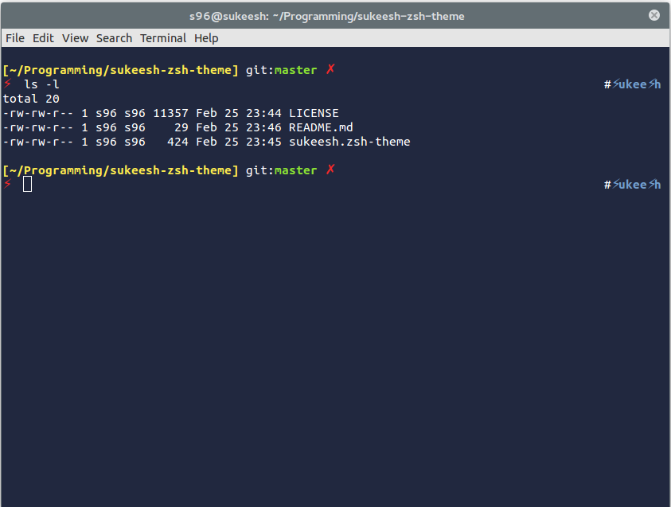

# Sukeesh theme for Oh My ZSH

## Installation

### Theme

1. Drop [`sukeesh.zsh-theme`]() into the `~/.oh-my-zsh/themes/` directory
2. Change the theme variable name to `ZSH_THEME="sukeesh"` in `~/.zshrc`
3. Reload ZSH with `source ~/.zshrc`